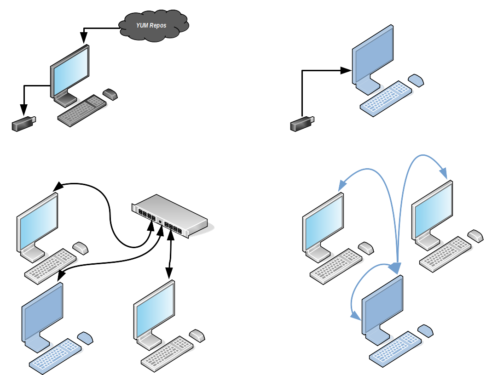

# offline-pkg-utility

Utility tool to download packages and setup a package manager server for an offline environment

## Use Case
1. To setup an offline, isolated network with package manager support
2. To provide package manager for other devices on a network
3. To save a copy of the available repos.

The above diagram describes use cases 1 and 2. Given a device with network access, use the tool to download all the packages from the available online repos and save them into an external storage (Top Left). Use the tool and external storage to copy repos and setup one out of the 3 workstations as a yum repo (Top Right, Blue). Connect all 3 workstations to a switch or on the same network (Bottom Left). Configure the other workstations to use the blue workstaion as their yum provider (Bottom Right).

## Supported OS / PM
1. CentOS (YUM)

## Assumptions / Requirements / Optionals

### Assumptions
1. All device to be configured to use the offline server are using the same architecture / OS.
2. User running the scripts are either root or in the sudoers.

### Download Requirements
1. python3
2. yum-utils (with reposync)

### Server Setup Requirements
1. python3
2. yum-utils (with createrepo)
3. httpd

### Optional
1. python3-tkinter (for GUI support)